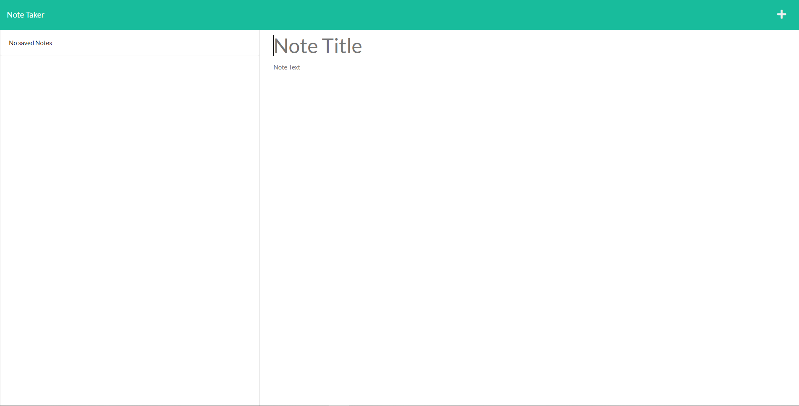

# NOTE TAKER

This is a node.js notetaker application deployed on heroku.

[Linked to deployed heroku app](https://dreadful-spirit-98896.herokuapp.com/)

## Description

This is our third node.js project and second challenge using express. It allows the user to create,  
save, and delete notes. I enjoyed learning how to build routes in express and this activity  
helped me better understand node modularization and express!

### Installing

This app is fully deployed on herokus free hosting. No install necessary!

### Executing program

Simply give your note a title and some text and click the save icon in the top right!  
The trashcan next to each note will allow you to delete that note.

### Testing

No testing available.

## Authors

Dylan Crowley:

[Github](https://github.com/dcrowdev)  
[Twitter](https://twitter.com/dcrowdev)  
[LinkedIn](https://www.linkedin.com/in/dylan-crowley-3974b8252/)  
dcrowdev1025@gmail.com

## License

This project is licensed under the MIT license.

## Acknowledgments

UCF Fullstack bootcamp!
